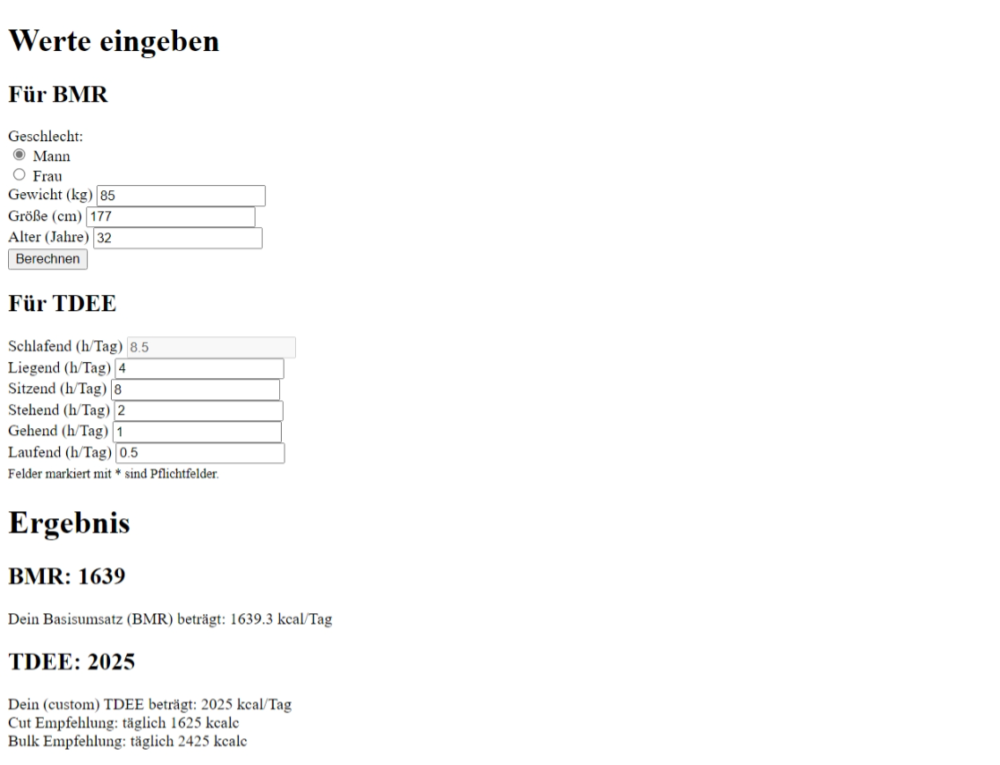

# Kalorienrechner
---
- Autor: Ingo Schlapschy
- Schuljahr: 2024/25
- Lehrgang: 2
- Klasse: 3aAPC
- Gruppe: C
- Fach: ITL12
- Datum: 2024-11-26
---
## Angabe

     1. Aufgabenstellung
Erstelle mit PHP eine Applikation, die folgende Werte einliest:
        1. Geschlecht, Alter, Gewicht und Größe
        2. tägliche Bewegung 
    a) Danach soll ein Kalorienbedarf berechnet werden:
Frauen: 655,1 + (9,6 x Körpergewicht in kg) + (1,8 x Körpergröße in cm) – (4,7 x Alter in Jahren)
Männer: 66,47 + (13,7 x Körpergewicht in kg) + (5 x Körpergröße in cm) – (6,8 x Alter in Jahren)
    b) dieser wird über den sogenannte PAL Faktor auf den Tag angepasst (in nachfolgender Tab)

Der Benutzer soll dabei angeben wieviel Zeit er auf die jeweilige Tätigkeit verwendet (in Stunden). Ein Formular mit allen Werten (ausser schlafen) wird angezeigt und überall kann eine Zeit eingegeben werden. Danach wird ein durchschnittlicher PAL Faktor berechnet und damit der oben berechnete Kalorienbedarf multipliziert.
Bsp: 4 h sitzend, 6 h Büro, 2 h stehend/gehend = 12 h Gesamt dh. 12 h Schlaf bleiben übrig. Berechnung: `4*1,2 + 6*1,45+2*1,85+12*0,95 / 24 = 1,19 (Durchschnitt)`

Das Ergebnis wird als täglicher Kalorienbedarf welche notwendig ist, um sein Gewicht zu halten, angegeben.
Um abzunehmen sollten ca. 400 Kalorien weniger konsumiert werden. Beim Zunehmen entsprechend deutlich mehr.

---
### ToDo
- [ ] Formular erstellen
- [ ] Werte auslesen
- [ ] Kalorienverbrauch berechnen und ausgeben
- [ ] Abgeben
## Lösung
Screenshot 
### index.php
#### Bereits eingegebene Werte auslesen
liest die bereits eingegebenen Werte aus den Feldern aus
setzt 0 ein, falls noch keine Eingabe besteht
```php
if ($_SERVER["REQUEST_METHOD"] == "POST") {
  // Read Input Values
  //isset necessary bc: on first loading of page, nothing's submitted yet
  $gender = isset($_POST['rbGender']) ? $_POST['rbGender'] : "";
  $weight = isset($_POST['tbWeight']) ? (int)$_POST['tbWeight'] : 0;
  $height = isset($_POST['tbHeight']) ? (int)$_POST['tbHeight'] : 0;
  $age = isset($_POST['tbAge']) ? (int)$_POST['tbAge'] : 0;
  $h_pal1 = isset($_POST['tbPal1']) ? $_POST['tbPal1'] : 0;
  $h_pal2 = isset($_POST['tbPal2']) ? $_POST['tbPal2'] : 0;
  $h_pal3 = isset($_POST['tbPal3']) ? $_POST['tbPal3'] : 0;
  $h_pal4 = isset($_POST['tbPal4']) ? $_POST['tbPal4'] : 0;
  $h_pal5 = isset($_POST['tbPal5']) ? $_POST['tbPal5'] : 0;
  $h_pal0 = 24 - ($h_pal1 + $h_pal2 + $h_pal3 + $h_pal4 + $h_pal5);
}
```

#### BMR berechnen
- geschlechtsspezifische Faktoren setzen
- BMR berechnen
```php
//Find Factors relevant for gender
if ($gender == "f") {
  $bmr = 655.1;
  $f_weight = 9.6;
  $f_height = 1.8;
  $f_age = 4.7;
} elseif ($gender == "m") {
  $bmr = 66.47;
  $f_weight = 13.7;
  $f_height = 5;
  $f_age = 6.8;
} else {
  echo "Kein Geschlecht gewählt, der mittelwert sämtlicher Einzelfaktoren wird verwendet. Das Ergebnis ist vmtl. komplett daneben...";
  $bmr = (655.1 + 66.47) / 2;
  $f_weight = (9.6 + 13.7) / 2;
  $f_height = (1.8 + 5) / 2;
  $f_age = (4.7 + 6.8) / 2;

//Calculate BMR
$bmr += (int)$weight * $f_weight;
$bmr += (int)$height * $f_height;
$bmr -= (int)$age * $f_age;
?>
}
```
#### Formfelder einfügen
- method="post"
- value= über php setzen
```html
<!--Input BMR-Values-->
  <h1>Werte eingeben</h1>
  <form method="post">
    <h2>Für BMR</h2>
    <div class="form-group">
      <label>Geschlecht: </label>
      <div class="form-check">
        <input class="form-check-input" type="radio" name="rbGender" value="m" <?php if ($gender == "m")  echo ' checked="checked"'; ?>> <label class="form-check-label">Mann</label>
      </div>
      <div class="form-check">
        <input class="form-check-input" type="radio" name="rbGender" value="f" <?php if ($gender == "f")  echo ' checked="checked"'; ?>> <label class="form-check-label">Frau</label>
      </div>
    </div>

    <div class="form-group">
      <label>Gewicht (kg)</label> <input type="number" class="form-control" name="tbWeight" value="<?php echo $weight; ?>">
    </div>

    <div class="form-group">
      <label>Größe (cm)</label> <input type="number" class="form-control" name="tbHeight" value="<?php echo $height; ?>">
    </div>

    <div class="form-group">
      <label>Alter (Jahre)</label> <input type="number" class="form-control" name="tbAge" value="<?php echo $age; ?>">
    </div>

    <div class="form-group">
      <input type="submit" class="btn btn-primary" name="btnCalculate" value="Berechnen">
    </div>

<!--Input TDEE-Values-->
    <h2>Für TDEE</h2>

    <div class="form-group">
      <label>Schlafend (h/Tag)</label> <input type="number" step="0.5" class="form-control" name="tbPal0" disabled value="<?php echo $h_pal0; ?>">
    </div>

    <div class="form-group">
      <label>Liegend (h/Tag)</label> <input type="number" step="0.5" class="form-control" name="tbPal1" value="<?php echo $h_pal1; ?>">
    </div>

    <div class="form-group">
      <label>Sitzend (h/Tag)</label> <input type="number" step="0.5" class="form-control" name="tbPal2" value="<?php echo $h_pal2; ?>">
    </div>

    <div class="form-group">
      <label>Stehend (h/Tag)</label> <input type="number" step="0.5" class="form-control" name="tbPal3" value="<?php echo $h_pal3; ?>">
    </div>

    <div class="form-group">
      <label>Gehend (h/Tag)</label> <input type="number" step="0.5" class="form-control" name="tbPal4" value="<?php echo $h_pal4; ?>">
    </div>

    <div class="form-group">
      <label>Laufend (h/Tag)</label> <input type="number" step="0.5" class="form-control" name="tbPal5" value="<?php echo $h_pal5; ?>">
    </div>

  </form>
```

#### BMR und TDEE ausgeben
```html
<!--Output Result-->
  <h1>Ergebnis</h1>
  <h2>BMR: <?php echo round($bmr) ?></h2>
  <al>Dein Basisumsatz (BMR) beträgt: <?php echo $bmr ?> kcal/Tag</p>

    <?php $tdee = $bmr * $pal  ?>
    <h2>TDEE: <?php echo round($tdee) ?></h2>
    <p>
      Dein (custom) TDEE beträgt: <?php echo round($tdee = $bmr * $pal) ?> kcal/Tag <br>
      Cut Empfehlung: täglich <?php echo round($tdee - 400) ?> kcal <br>
      Bulk Empfehlung: täglich <?php echo round($tdee + 400) ?> kcal <br>
    </p>
```

## Fazit
- Hatte das Projekt ursprünglich auf 2 Dateien aufgeteilt. 
	- index.html und
	- calculation.php
- Dass ich da dann immer auf die neue Seite umgeleitet wurde und zurück zur ersten musste um Eingaben zu ändern hat mir nicht gefallen.
- Da ich bei der Neuinstallation von XAMPP (für ITL4 JOOMLA!) dummerweise mein Projekt gelöscht hatte, das zwar fertig programmiert, aber noch nicht dokumentiert war, und das ich auch noch nicht auf Github gesichert hatte, habe ich es nochmal neu umgesetzt.
- Neue version hat Eingabe und Ausgabe auf der selben Seite, um usability zu erhöhen.
- Verwende jetzt auch VSCode statt Netbeans. Gefällt mir bis jetzt besser. Die Hinweise bei Netbeans fand ich kaum hilfreich.
- Ich weiß aber noch nicht, wie ich bei VSCode sinnvoll einen Debugger einsetze, die Implementierung davon habe ich nicht erfolgreich geschafft.
- Dafür kenne ich jetzt den Befehl `var_dump`, der auch sehr hilfreich beim debuggen ist.
- Die Lektion, dass ich regelmäßig commiten und pushen sollte, war bestimmt auch hilfreich.
- Bin mit der Funktioalität des Ergebnisses zufrieden.
	- Obwohl ich anmerken muss, dass diese Umsetzung NICHT dem entspricht, wie der PAL verwendet wird!
- Designtechnisch ist noch einiges an Luft nach oben, aber ich hab bis jetzt noch keine Ahnung wie man einigermaßen sinnvoll an sowas rangeht.
- Den ?-Operator in PHP finde ich toll